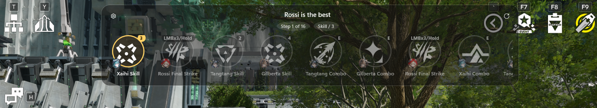
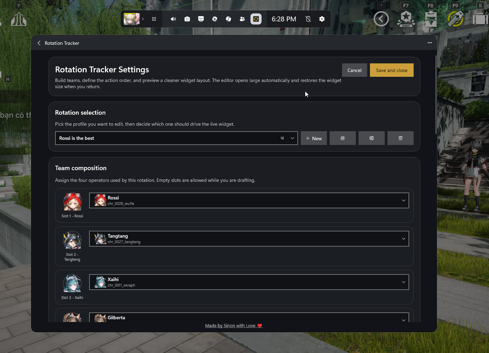

# Rotation Tracker

Rotation Tracker is a rotation helper widget for Xbox Game Bar on Windows, designed for Arknights: Endfield.

It is not a macro, not an auto-play tool, and does not interact with or modify the game in any way. It does not read memory, inject code, or automate gameplay. It simply provides a visual tool to help you understand and track your own rotation inside Xbox Game Bar.

## Language

- [English](#english)
- [Tiếng Việt](#tieng-viet)

## English

### What it does

- Shows your current rotation step
- Lets you create, edit, import, and share rotation profiles
- Works as an Xbox Game Bar widget
- Can keep an elevated helper running for admin games after restart

### Screenshots

### Why the elevated helper exists

Arknights: Endfield is required to run with administrator privileges. Rotation Tracker also needs a helper running at the same privilege level so it can keep listening to keyboard and mouse input correctly. The installer starts that helper automatically, and uninstall removes it.

### Install

1. [Download the latest release from GitHub](https://github.com/SinonCute/RotationTracker/releases). Under **Assets**, get the installer zip — for example `RotationTracker-v0.3-beta-installer.zip` — newer releases use a different version in the filename.
2. Extract everything into one folder
3. Run `install.exe` and approve the Windows administrator prompt
4. Open Xbox Game Bar with `Win + G`
5. Add **Rotation Tracker**

### Upgrade

1. [Download the newest release from GitHub](https://github.com/SinonCute/RotationTracker/releases). Under **Assets**, get the installer zip (e.g. `RotationTracker-v0.3-beta-installer.zip`; the `v…` part updates with each release), extract it if needed, then continue in that folder.
2. Run `install.exe` again and approve the Windows administrator prompt

Your saved rotations are kept automatically.

### Uninstall

1. Run `uninstall.exe` and approve the Windows administrator prompt

Your rotation backup is preserved so you can install again later without losing it.

### Saved rotations

Your saved rotation data is backed up here:

`%LOCALAPPDATA%\RotationTracker\rotation-settings.json`

### Help and contact

If you need help or want to contact the author:

- Discord server: https://discord.gg/be7RgpxjSk
- Email: `contact@hiencao.me`

## Tiếng Việt

### Giới thiệu

Rotation Tracker là một widget cho Xbox Game Bar trên Windows, được thiết kế cho Arknights: Endfield.

Đây không phải macro, không phải auto-play, và không can thiệp vào game dưới bất kỳ hình thức nào. Nó không đọc bộ nhớ, không inject code, và không tự động hóa gameplay. Công cụ này chỉ hiển thị để bạn theo dõi và hiểu rotation của mình ngay trong Xbox Game Bar.

### Tính năng

- Hiển thị bước rotation hiện tại
- Cho phép tạo, sửa, import và chia sẻ profile rotation
- Chạy như một Xbox Game Bar widget
- Có thể giữ helper ở quyền admin để hỗ trợ game chạy quyền quản trị sau khi restart

### Vì sao cần elevated helper

Arknights: Endfield bắt buộc phải chạy với quyền administrator. Rotation Tracker cũng cần một helper chạy cùng mức quyền đó để có thể tiếp tục lắng nghe input từ bàn phím và chuột đúng cách. Trình cài đặt sẽ tự bật helper này, và gỡ cài đặt sẽ xóa nó.

### Cài đặt

1. [Tải bản phát hành mới nhất từ GitHub](https://github.com/SinonCute/RotationTracker/releases). Trong mục **Assets**, tải file zip cài đặt — ví dụ `RotationTracker-v0.3-beta-installer.zip` — bản mới hơn sẽ có tên phiên bản khác trong tên file.
2. Giải nén toàn bộ vào cùng một thư mục
3. Chạy `install.exe` và xác nhận hộp thoại administrator của Windows
4. Mở Xbox Game Bar bằng `Win + G`
5. Thêm **Rotation Tracker**

### Nâng cấp

1. [Tải bản phát hành mới nhất từ GitHub](https://github.com/SinonCute/RotationTracker/releases). Trong **Assets**, tải zip cài đặt (ví dụ `RotationTracker-v0.3-beta-installer.zip`; phần `v…` thay đổi theo từng bản), giải nén thư mục đó.
2. Chạy lại `install.exe` và xác nhận hộp thoại administrator của Windows

Rotation đã lưu sẽ được giữ lại tự động.

### Gỡ cài đặt

1. Chạy `uninstall.exe` và xác nhận hộp thoại administrator của Windows

Bản sao lưu rotation vẫn được giữ lại để bạn cài lại sau này mà không bị mất dữ liệu.

### Dữ liệu đã lưu

Dữ liệu rotation được sao lưu tại:

`%LOCALAPPDATA%\RotationTracker\rotation-settings.json`

### Hỗ trợ và liên hệ

Nếu bạn cần hỗ trợ hoặc muốn liên hệ tác giả:

- Discord server: https://discord.gg/be7RgpxjSk
- Email: `contact@hiencao.me`
